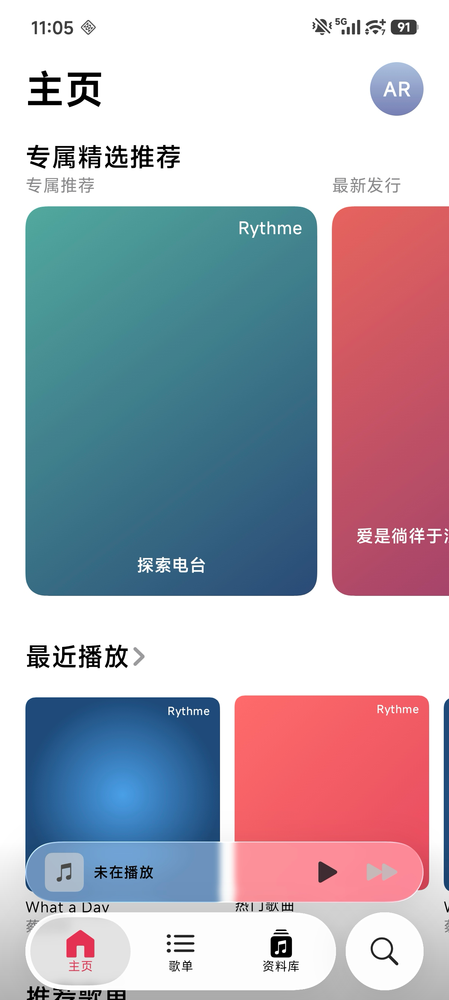

<div align="center">

# Rythme

**A modern Android local music player with liquid glass effects**

**一款具有液态玻璃效果的现代 Android 本地音乐播放器**

[](https://developer.android.com)
[](https://kotlinlang.org)
[](https://developer.android.com/jetpack/compose)
[](LICENSE)

</div>

---

<details>
<summary><b>English</b></summary>

## About

Rythme is an open-source Android music player designed for local audio files, inspired by Apple Music's visual design. It features iOS-style frosted glass / liquid glass effects, smooth shared-element transitions, and a clean MVI architecture — all built with 100% Jetpack Compose and zero XML layouts.

### Goals

- Deliver a polished, fluid music playback experience on Android
- Showcase modern Android development best practices (Compose, MVI, Navigation3, Koin)
- Bring liquid glass morphism and smooth gesture-driven animations to a music player
- Stay lightweight and offline — no network dependency, no accounts, just your music

## Screenshots

<div align="center">

&nbsp;&nbsp;

</div>

## Features

### Completed

- [x] **Full-screen Player** — album art, playback controls (play/pause, next/previous, shuffle, repeat), seek bar, volume slider
- [x] **Liquid Glass Effects** — frosted blur, vibrancy, lens refraction using AGSL shaders (API 33+)
- [x] **Mini Player** — persistent bottom bar with current track info and quick controls
- [x] **Glass Bottom Navigation** — animated tab selector with press deformation and spring physics
- [x] **Shared Element Transitions** — smooth mini player to full player animation
- [x] **Drag-to-Dismiss** — gesture to close the full-screen player with squash & stretch deformation
- [x] **Album Art Theme Extraction** — dynamic color palette derived from current track artwork
- [x] **Local Music Scanning** — MediaStore-based scanner with Room caching
- [x] **Auto Refresh** — MediaStoreObserver detects file changes and refreshes automatically
- [x] **Background Playback** — foreground service with MediaSession & notification controls
- [x] **MVI Architecture** — strict unidirectional data flow across all features
- [x] **Type-safe Navigation** — Navigation3 with serializable routes, per-tab back stacks

### Planned

- [ ] **Home Screen** — carousel with recommended content sections
- [ ] **Library Browser** — organized by playlists, artists, albums, songs
- [ ] **Search Categories** — grid of music category cards
- [ ] **Song List View** — scrollable list with artwork and transition animations
- [ ] **Light / Dark Theme** — dynamic theming
- [ ] Search functionality (text search for artists, songs)
- [ ] Playlist creation & management
- [ ] Favorites & recently played tracking
- [ ] Artist / Album detail pages
- [ ] Equalizer controls
- [ ] Lyrics display
- [ ] Settings screen
- [ ] Playback queue management
- [ ] Sleep timer

## Tech Stack

| Category | Technology |
|---|---|
| **Language** | Kotlin 2.3.10 |
| **UI** | Jetpack Compose (BOM 2026.02), Material3 |
| **Architecture** | MVI (custom BaseViewModel), single-activity |
| **Navigation** | AndroidX Navigation3 1.0.1 (type-safe routes) |
| **DI** | Koin 4.1.1 |
| **Media** | Media3 / ExoPlayer 1.9.2, MediaSession |
| **Database** | Room 2.8.4 |
| **Image Loading** | Coil 3.4.0 (OkHttp) |
| **Glass Effects** | [backdrop](https://github.com/aspect-build/backdrop) 1.0.6, [haze](https://github.com/nicholasgasior/haze) 1.7.2 |
| **Color Extraction** | Palette 1.0.0 |
| **Preferences** | DataStore 1.2.0 |
| **Serialization** | kotlinx-serialization |
| **Build** | AGP 9.0.1, Gradle 9.1.0, KSP 2.3.6 |
| **Min SDK** | 33 (Android 13) |
| **Target SDK** | 36 |

## Architecture

Rythme follows a single-module architecture with clear layer separation:

```
app/src/main/java/com/aria/rythme/
├── core/
│   ├── mvi/            # BaseViewModel, marker interfaces
│   ├── music/          # Domain models, Room DB, MediaStore, PlaybackController
│   ├── navigation/     # NavigationState, Navigator, RythmeRoute
│   └── extensions/     # Compose helpers
├── feature/            # One package per screen (home, player, library, search, ...)
│   └── {name}/
│       ├── {Name}Contract.kt    # Intent / State / Action / Effect
│       ├── {Name}ViewModel.kt   # handleIntent() + reduce()
│       └── {Name}Screen.kt      # Compose UI
├── ui/
│   ├── component/      # Shared composables (MiniPlayer, BottomTabs, ...)
│   └── theme/          # Colors, typography, theming
└── di/                 # Koin modules
```

### Data Flow

```
MediaStore / Room DB
       ↓
  MusicRepository (StateFlows)
       ↓
  ViewModel (MVI: Intent → Action → State)
       ↓
  Compose UI (collectAsState)
```

### Key Design Decisions

- **Player is NOT a route** — it renders as an `AnimatedVisibility` overlay so the bottom nav and back stack remain alive underneath
- **Glass effects require API 33+** for full lens refraction; blur/vibrancy work on API 31+
- **No XML layouts** — the entire UI is Jetpack Compose
- **No Hilt** — Koin is used for dependency injection
- **No network** — all media comes from local MediaStore

## Getting Started

### Prerequisites

- Android Studio Ladybug or later
- Android SDK 36
- JDK 11+
- A device or emulator running Android 13+ (API 33)

### Build & Run

```bash
# Clone
git clone https://github.com/ariazz98/Rythme.git
cd Rythme

# Build debug APK
./gradlew assembleDebug

# Install on connected device
./gradlew installDebug

# Run tests
./gradlew test

# Lint
./gradlew lint
```

### Permissions

The app requires the following permissions:

| Permission | Purpose |
|---|---|
| `READ_MEDIA_AUDIO` | Access local audio files (Android 13+) |
| `FOREGROUND_SERVICE` | Background music playback |
| `FOREGROUND_SERVICE_MEDIA_PLAYBACK` | Media playback service type |

## Contributing

Contributions are welcome! Please:

1. Fork the repository
2. Create a feature branch (`git checkout -b feature/amazing-feature`)
3. Follow the existing MVI pattern for new features
4. Commit your changes (`git commit -m 'Add amazing feature'`)
5. Push to the branch (`git push origin feature/amazing-feature`)
6. Open a Pull Request

## License

This project is licensed under the Apache License 2.0 — see the [LICENSE](LICENSE) file for details.

</details>

---

<details open>
<summary><b>中文</b></summary>

## 关于

Rythme 是一款开源 Android 本地音乐播放器，设计灵感来自 Apple Music。它采用 iOS 风格的毛玻璃/液态玻璃视觉效果、流畅的共享元素过渡动画，以及清晰的 MVI 架构——全部使用 Jetpack Compose 构建，零 XML 布局。

### 项目目标

- 在 Android 上提供精致、流畅的音乐播放体验
- 展示现代 Android 开发最佳实践（Compose、MVI、Navigation3、Koin）
- 将液态玻璃拟态和手势驱动动画带入音乐播放器
- 保持轻量和离线——无需网络、无需账户，只播放你的音乐

## 截图

<div align="center">

&nbsp;&nbsp;

</div>

## 功能

### 已完成

- [x] **全屏播放器** — 专辑封面、播放控制（播放/暂停、上一首/下一首、随机、循环）、进度条、音量调节
- [x] **液态玻璃效果** — 使用 AGSL 着色器实现毛玻璃模糊、鲜艳度增强、镜头折射（API 33+）
- [x] **迷你播放器** — 底部常驻栏，显示当前曲目信息和快捷控制
- [x] **玻璃底部导航栏** — 带按压形变和弹簧物理动画的标签选择器
- [x] **共享元素过渡** — 迷你播放器到全屏播放器的平滑动画
- [x] **下拉关闭手势** — 拖拽关闭全屏播放器，带挤压拉伸形变
- [x] **封面主题色提取** — 从当前曲目封面动态提取调色板
- [x] **本地音乐扫描** — 基于 MediaStore 的扫描器，Room 数据库缓存
- [x] **自动刷新** — MediaStoreObserver 监听文件变化并自动刷新
- [x] **后台播放** — 前台服务 + MediaSession + 通知栏控制
- [x] **MVI 架构** — 所有功能模块严格遵循单向数据流
- [x] **类型安全导航** — Navigation3 + 序列化路由，按标签管理返回栈

### 待完成
- [ ] **主页** — 轮播图 + 推荐内容区块
- [ ] **资料库浏览** — 按歌单、艺人、专辑、歌曲分类
- [ ] **搜索分类** — 音乐分类卡片网格
- [ ] **歌曲列表** — 带封面图和过渡动画的滚动列表
- [ ] **亮色/暗色主题** — 动态主题
- [ ] 搜索功能（按艺人、歌曲等搜索）
- [ ] 歌单创建与管理
- [ ] 收藏与最近播放记录
- [ ] 艺人/专辑详情页
- [ ] 均衡器控制
- [ ] 歌词显示
- [ ] 设置页面
- [ ] 播放队列管理
- [ ] 睡眠定时器

## 技术栈

| 类别 | 技术 |
|---|---|
| **语言** | Kotlin 2.3.10 |
| **UI** | Jetpack Compose (BOM 2026.02)、Material3 |
| **架构** | MVI（自定义 BaseViewModel）、单 Activity |
| **导航** | AndroidX Navigation3 1.0.1（类型安全路由） |
| **依赖注入** | Koin 4.1.1 |
| **媒体播放** | Media3 / ExoPlayer 1.9.2、MediaSession |
| **数据库** | Room 2.8.4 |
| **图片加载** | Coil 3.4.0 (OkHttp) |
| **玻璃效果** | [backdrop](https://github.com/aspect-build/backdrop) 1.0.6、[haze](https://github.com/nicholasgasior/haze) 1.7.2 |
| **取色** | Palette 1.0.0 |
| **偏好存储** | DataStore 1.2.0 |
| **序列化** | kotlinx-serialization |
| **构建** | AGP 9.0.1、Gradle 9.1.0、KSP 2.3.6 |
| **最低 SDK** | 33 (Android 13) |
| **目标 SDK** | 36 |

## 架构

Rythme 采用单模块架构，层次分明：

```
app/src/main/java/com/aria/rythme/
├── core/
│   ├── mvi/            # BaseViewModel、标记接口
│   ├── music/          # 领域模型、Room 数据库、MediaStore、PlaybackController
│   ├── navigation/     # NavigationState、Navigator、RythmeRoute
│   └── extensions/     # Compose 扩展函数
├── feature/            # 每个页面一个包（home、player、library、search……）
│   └── {name}/
│       ├── {Name}Contract.kt    # Intent / State / Action / Effect
│       ├── {Name}ViewModel.kt   # handleIntent() + reduce()
│       └── {Name}Screen.kt      # Compose UI
├── ui/
│   ├── component/      # 共享组件（MiniPlayer、BottomTabs……）
│   └── theme/          # 颜色、字体、主题
└── di/                 # Koin 模块
```

### 数据流

```
MediaStore / Room 数据库
       ↓
  MusicRepository（StateFlow）
       ↓
  ViewModel（MVI：Intent → Action → State）
       ↓
  Compose UI（collectAsState）
```

### 关键设计决策

- **播放器不是路由** — 它作为 `AnimatedVisibility` 覆盖层渲染，底部导航和返回栈保持活跃
- **玻璃效果要求 API 33+** 才能获得完整的镜头折射效果；模糊和鲜艳度在 API 31+ 可用
- **零 XML 布局** — 整个 UI 均为 Jetpack Compose
- **不使用 Hilt** — 使用 Koin 进行依赖注入
- **不依赖网络** — 所有媒体数据来自本地 MediaStore

## 开始使用

### 前置条件

- Android Studio Ladybug 或更高版本
- Android SDK 36
- JDK 11+
- Android 13+（API 33）的设备或模拟器

### 构建与运行

```bash
# 克隆
git clone https://github.com/ariazz98/Rythme.git
cd Rythme

# 构建 debug APK
./gradlew assembleDebug

# 安装到连接的设备
./gradlew installDebug

# 运行测试
./gradlew test

# Lint 检查
./gradlew lint
```

### 权限

应用需要以下权限：

| 权限 | 用途 |
|---|---|
| `READ_MEDIA_AUDIO` | 访问本地音频文件（Android 13+） |
| `FOREGROUND_SERVICE` | 后台音乐播放 |
| `FOREGROUND_SERVICE_MEDIA_PLAYBACK` | 媒体播放服务类型 |

## 贡献

欢迎贡献！请：

1. Fork 本仓库
2. 创建功能分支（`git checkout -b feature/amazing-feature`）
3. 新功能请遵循现有的 MVI 模式
4. 提交更改（`git commit -m 'Add amazing feature'`）
5. 推送到分支（`git push origin feature/amazing-feature`）
6. 发起 Pull Request

## 许可证

本项目基于 Apache License 2.0 许可证开源——详见 [LICENSE](LICENSE) 文件。

</details>
